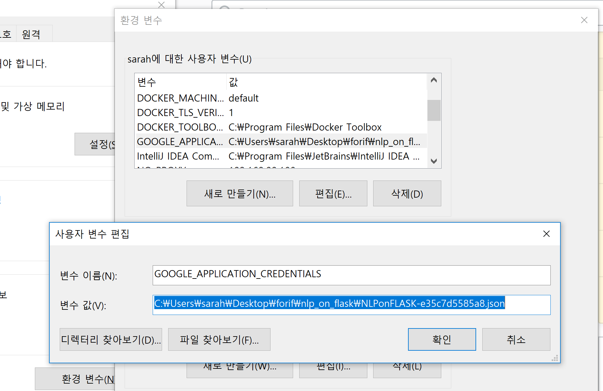
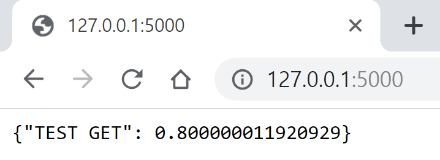
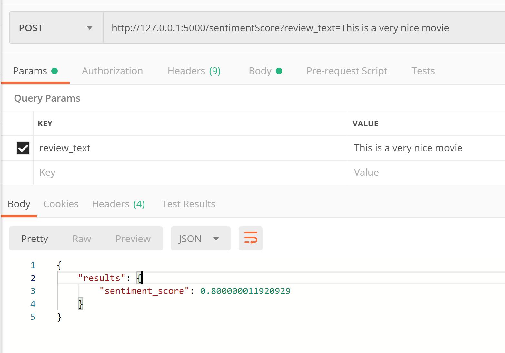

# Flask API tutorial (with codes)

date : 2019 - 09 - 01 

### 완전 간단한 형태의 코드 - "Hello World 반환하기"

    from flask import Flask, jsonify
    app = Flask(__name__)
    
    #this annotation converts this method into url endpoint 
    @app.route("/")
    def hello():
        return jsonify({"about" : "Hello World!"})
    
    if __name__ == '__main__':
        app.run(debug=True)

### 조금 더 REST API처럼 보이게 하기 - GET and POST

쿼리를 /multi/{숫자} 로 날리면 숫자에다가 10을 곱한 결과를 JSON형태로 반환해준다. 

     from flask import Flask, jsonify, request
    
    app = Flask(__name__)
    
    @app.route('/', methods = ['GET', 'POST'])
    def index():
        if(request.method == 'POST'):
            some_json = request.get_json()
            return jsonify({'you_sent' : some_json}), 201
        else:
    				#default request will be 'GET'
            return jsonify({"about" : "Hello World !"})
        
    @app.route('/multi/<int:num>', methods=['GET']) #url endpoint 설정 가능 
    def get_multiply10(num):
        return jsonify({'result' : num*10})
    
    if __name__ == '__main__':
        app.run()

그냥 주소만 입력하면 위의 else 문이 실행되어서 JSON 형태의 Hello World 가 나타난다. 

### flask_restful 을 활용해서 GET POST 날리기

    from flask import Flask, request 
    from flask_restful import Resource, Api
    #Resource is the main building block of restful 
    
    app = Flask(__name__)
    api = Api(app)
    #we now have an api that is build on top of the app 
    
    class HelloWorld(Resource):
     #it is much cleaner than decorating with many 'route's
        def get(self):
            return {"about" : "Hello Restful"}
        
        def post(self):
            some_json = request.get_json()
            return {"you sent" : some_json}, 201
        
    
    class Multi(Resource):
        def get(self, num):
            return {"result" : num*10}
        
    
    api.add_resource(HelloWorld, '/') #bound it to the route '/'
    api.add_resource(Multi, '/multi/<int:num>') 
    
    if __name__ == '__main__':
        app.run()

### /multi/10 으로 요청을 보냈을 때

### 기본 주소로 GET 요청을 보냈을 때

### Google NLP API 에 응용하기

사용자 환경 변수를 json 파일의 경로로 설정해준다. [GOOGLE_APPLICATION_CREDENTIALS] 

    from flask import Flask
    from flask_restful import Resource, Api
    from google.cloud import language
    from google.cloud.language import enums
    from google.cloud.language import types
    # Imports the Google Cloud client library
    
    
    app = Flask(__name__)
    api = Api(app)
    
    #include code for getting credentials 
    #include code for posting JSON -> getting result as a JSON 
    
    class ReviewSentiment(Resource):
        def get(self):
            # Instantiates a client
            client = language.LanguageServiceClient()
    
            # The text to analyze
            text = 'Very nice movie'
            document = types.Document(
                content=text,
                type=enums.Document.Type.PLAIN_TEXT)
            
            # Detects the sentiment of the text
            sentiment = client.analyze_sentiment(document=document).document_sentiment
            print('Text: {}'.format(text))
            print('Sentiment: {}, {}'.format(sentiment.score, sentiment.magnitude))
            
            return {"TEST GET" : sentiment.score}
        
    api.add_resource(ReviewSentiment, '/')
    
    
    if __name__ == '__main__':
        app.run()

위의 코드를 돌리면 이렇게 우측에 스코어 값이 뜬다. 

### application default credentials 를 사용했다

    C:\Users\sarah\AppData\Local\Google\Cloud SDK>gcloud auth application-default login

명령을 실행시켜주면 현재 환경 변수가 무었이고, 프로그램은 default credentials 파일에서 정보를 가져올 것이라는 텍스트가 나타난다. 

Y/n 이런식으로 더 진행할 것인지 묻는데, Y라고 치고 엔터를 누르면 된다. 

### 참고로 현재 프로젝트를 기본값으로 설정할 때는

    C:\Users\sarah\AppData\Local\Google\Cloud SDK>gcloud config set project {my-project-id}

형식으로 쳐주면 된다. 

### POST 로 Sentiment Analysis를 할 text string을 보내고 JSON으로 응답 받기

    from flask import Flask
    from flask_restful import Resource, Api, reqparse
    from google.cloud import language
    from google.cloud.language import enums
    from google.cloud.language import types
    
    # Imports the Google Cloud client library
    
    
    app = Flask(__name__)
    api = Api(app)
    
    class ReviewSentiment(Resource):
        
        def get_sentiment_score(self, review_text):
            # Instantiates a client
            client = language.LanguageServiceClient()
            
            # The text to analyze
            text = review_text
            document = types.Document(
                content=text,
                type=enums.Document.Type.PLAIN_TEXT)
            
            # Detects the sentiment of the text
            sentiment = client.analyze_sentiment(document=document).document_sentiment
            #print('Text: {}'.format(text))
            #print('Sentiment: {}, {}'.format(sentiment.score, sentiment.magnitude))
            return {"sentiment_score" : sentiment.score}
        
        
        def post(self):
            try:
                parser = reqparse.RequestParser()
                #add_argument - specifying where to pull values from 
                parser.add_argument('review_text', type=str)
                args = parser.parse_args() 
                sentiment_score = self.get_sentiment_score(args['review_text'])
                return {'results' : sentiment_score}
     
            except Exception as e:
                return {'error' : str(e)}
        
    api.add_resource(ReviewSentiment, '/sentimentScore')
    
    if __name__ == '__main__':
        app.run()

**Postman 을 활용해서 POST요청을 날렸다. 아래와 같이 results 아래에 sentiment_score이란 key 값으로 score 값이 날라온다.**

- links:

[Quickstart - Flask-RESTful 0.3.7 documentation](https://flask-restful.readthedocs.io/en/latest/quickstart.html)

[Request Parsing - Flask-RESTful 0.2.1 documentation](https://flask-restful.readthedocs.io/en/0.3.5/reqparse.html)