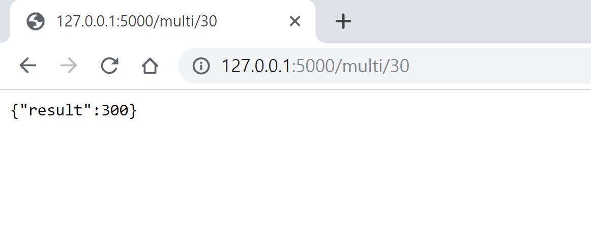
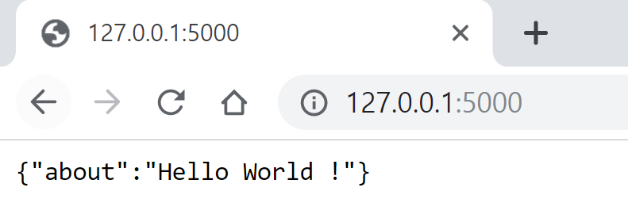
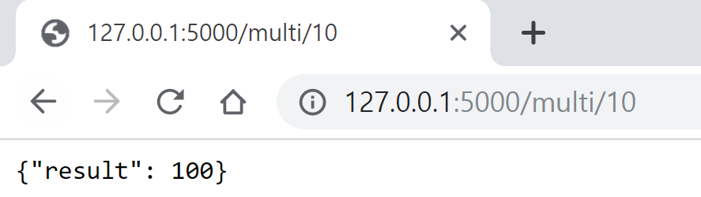
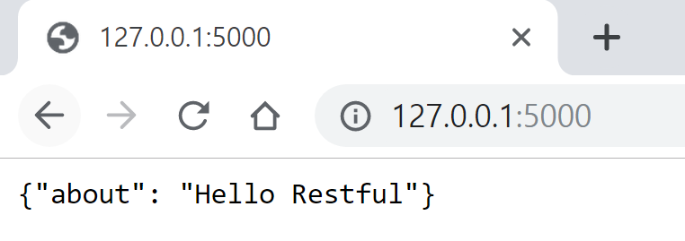

# Flask API tutorial (with codes)

date : 2019 - 09 - 01 

### 완전 간단한 형태의 코드 - "Hello World 반환하기"

    from flask import Flask, jsonify
    app = Flask(__name__)
    
    #this annotation converts this method into url endpoint 
    @app.route("/")
    def hello():
        return jsonify({"about" : "Hello World!"})
    
    if __name__ == '__main__':
        app.run(debug=True)

### 조금 더 REST API처럼 보이게 하기 - GET and POST

쿼리를 /multi/{숫자} 로 날리면 숫자에다가 10을 곱한 결과를 JSON형태로 반환해준다. 

     from flask import Flask, jsonify, request
    
    app = Flask(__name__)
    
    @app.route('/', methods = ['GET', 'POST'])
    def index():
        if(request.method == 'POST'):
            some_json = request.get_json()
            return jsonify({'you_sent' : some_json}), 201
        else:
    				#default request will be 'GET'
            return jsonify({"about" : "Hello World !"})
        
    @app.route('/multi/<int:num>', methods=['GET']) #url endpoint 설정 가능 
    def get_multiply10(num):
        return jsonify({'result' : num*10})
    
    if __name__ == '__main__':
        app.run()

그냥 주소만 입력하면 위의 else 문이 실행되어서 JSON 형태의 Hello World 가 나타난다. 

### flask_restful 을 활용해서 GET POST 날리기

    from flask import Flask, request 
    from flask_restful import Resource, Api
    #Resource is the main building block of restful 
    
    app = Flask(__name__)
    api = Api(app)
    #we now have an api that is build on top of the app 
    
    class HelloWorld(Resource):
     #it is much cleaner than decorating with many 'route's
        def get(self):
            return {"about" : "Hello Restful"}
        
        def post(self):
            some_json = request.get_json()
            return {"you sent" : some_json}, 201
        
    
    class Multi(Resource):
        def get(self, num):
            return {"result" : num*10}
        
    
    api.add_resource(HelloWorld, '/') #bound it to the route '/'
    api.add_resource(Multi, '/multi/<int:num>') 
    
    if __name__ == '__main__':
        app.run()

### /multi/10 으로 요청을 보냈을 때

### 기본 주소로 GET 요청을 보냈을 때

